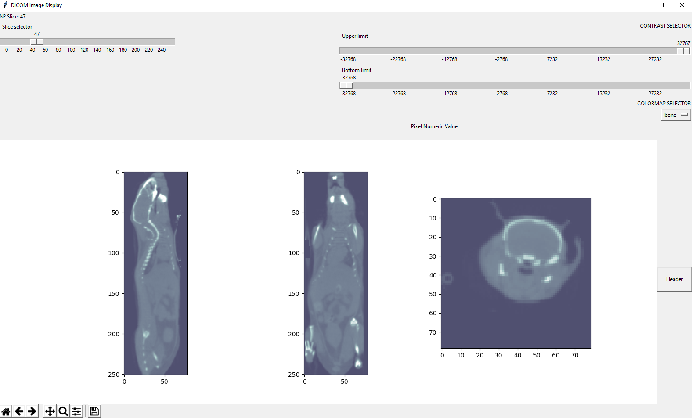

# 11763 Procesamiento de Imagen Médica - Práctica 1 

Visualizador DICOM con las siguientes funciones: 
- cargar imágenes DICOM mediante instrucciones de código

– interfaz para, manualmente, visualizar las imágenes 2D, incluyendo zoom, ajuste de contraste y selección de cortes

– interfaz para, manualmente, seleccionar píxeles y obtener su valor numérico

– interfaz para, manualmente, explorar las cabeceras DICOM de la imagen

– registrar todas las acciones que hace el usuario para poder extraer información a posteriori

Jonatan Mariscal García
Universitat de les Illes Balears
